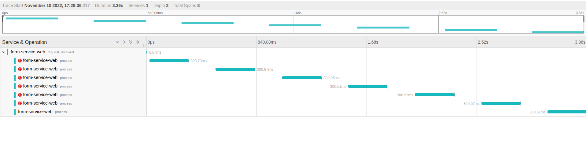

# Tracing
Tracing is a powerful tool that helps understand how a request flows through the system.
In order to enable tracing in KP, you can add the middlewares.Tracing middleware.

This middleware will start a new trace span for every message processed and record any errors that occur during processing. It will also inject trace headers into the message if they are not already present.

:::warning
Using trace middleware without a correctly configured trace provider will result in invalid spans being produced.
:::

## Sample trace {#screenshot}
In the following picture, a message failed to be processed 6 times and was successfully processed the 7th time.


### Example {#example}

To use this middleware, you will need to provide a `TracerProvider` that creates Tracer instances.

```go
package main

import (
	"context"
	"github.com/confluentinc/confluent-kafka-go/kafka"
	"github.com/honestbank/kp/v2/middlewares/retry"
	"os"

	"github.com/honestbank/kp/v2"
	"github.com/honestbank/kp/v2/middlewares/tracing"
	"go.opentelemetry.io/otel"
	"go.opentelemetry.io/otel/exporters/jaeger"
	"go.opentelemetry.io/otel/sdk/resource"
	"go.opentelemetry.io/otel/sdk/trace"
	semconv "go.opentelemetry.io/otel/semconv/v1.10.0"
)

func main() {
	defer setupTracing()() // this is important and not included in KP
	kp := v2.New[kafka.Message]()
	kp.AddMiddleware(tracing.NewTracingMiddleware(otel.GetTracerProvider())) // This adds tracing middleware
	kp.AddMiddleware(retry.NewRetryMiddleware(producer, func(err error) {}))
	kp.AddMiddleware(tracing.NewTracingMiddleware(otel.GetTracerProvider())) // This adds tracing middleware
	err := kp.Process(processUserLoggedInEvent)
	if err != nil {
		panic(err) // do better error handling
	}
}

func processUserLoggedInEvent(ctx context.Context, message *kafka.Message) error {
	// here, you can focus on your business logic.
	fmt.Printf("processing %v\n", message)
	time.Sleep(time.Millisecond * 200) // simulate long-running process
	return nil                         // or error
}

func setupTracing() func() {
	exporter, err := jaeger.New(jaeger.WithCollectorEndpoint(jaeger.WithEndpoint(os.Getenv("COLLECTOR_URL"))))
	if err != nil {
		panic(err)
	}
	resc := resource.Default()
	tp := trace.NewTracerProvider(
		trace.WithBatcher(exporter),
		trace.WithResource(resc),
		trace.WithResource(resource.NewWithAttributes(semconv.SchemaURL, semconv.ServiceNameKey.String("form-service-web"))),
	)
	otel.SetTracerProvider(tp)
	return func() {
		exporter.Shutdown(context.Background())
		tp.Shutdown(context.Background())
	}
}

func getConfig() any {
	return nil // return your config
}
```

With this setup, all messages processed by KP will have trace spans created for them and any errors that occur will be recorded in the trace span. These trace spans can then be exported to a trace backend for further analysis.
